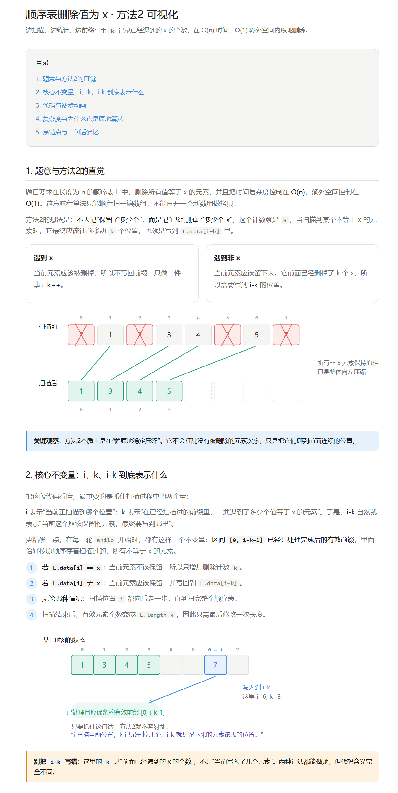
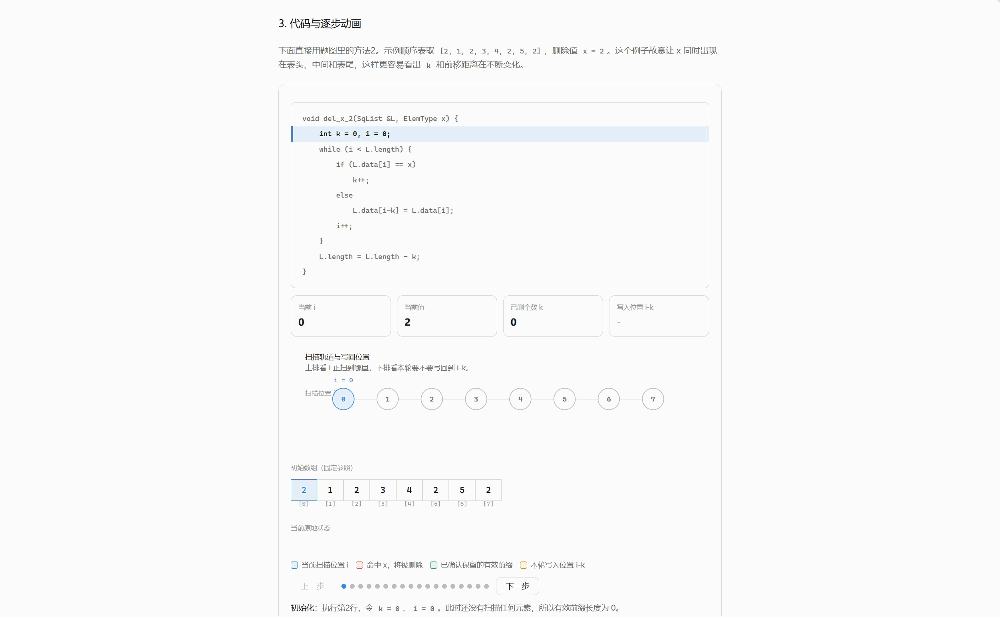

# claude-algo-visualize

[English](README.en.md)

用于生成交互式单文件 HTML 页面的 Claude Code 技能，专注数据结构与算法的教学可视化。设计风格受 Claude Desktop 可视化功能启发，提炼为可独立复用的技能包。

## 示例

**静态内容与 SVG 图示：**



**交互式逐步动画：**



[Live Demo](https://l0dyv.github.io/claude-algo-visualize/references/heap_overview.html) -- 完整交互式参考实现

## 功能

- 生成完整的交互式 HTML 教学页面（单文件，无外部依赖）
- 支持多种输入场景：PDF/教材讲解、主题动画演示、代码执行可视化、概念对比
- 内置 CSS 骨架（含深色模式）和三套 JS 动画模板
- SVG 图示 + 逐步动画 + 代码高亮联动
- 数组、完全二叉树、自定义坐标树等多种可视化形式

## 安装

```bash
npx skills add L0dyv/claude-algo-visualize
```

或手动克隆到 Claude Code 技能目录：

```bash
git clone https://github.com/L0dyv/claude-algo-visualize.git ~/.claude/skills/claude-algo-visualize
```

## 项目结构

```
claude-algo-visualize/
├── SKILL.md                  # 技能定义与使用指南
├── assets/
│   ├── base.css              # CSS 骨架（含深色模式）
│   ├── boilerplate.js        # JS 动画模板（A/B/C 三套）
│   └── animation-html.html   # HTML 动画骨架（三种结构）
└── references/
    └── heap_overview.html    # 完整参考实现
```

## 使用

安装后在 Claude Code 中自动激活。适用场景：

- 提供 PDF/教材，要求生成知识点讲解页面
- 给出主题（如"演示快排"），生成教学 + 动画页面
- 提供代码/算法，生成逐步执行动画
- 要求对比两个概念或解释原理

## 致谢

本项目感谢 [Linux.do](https://linux.do) 社区对开源分享与传播的推动。
